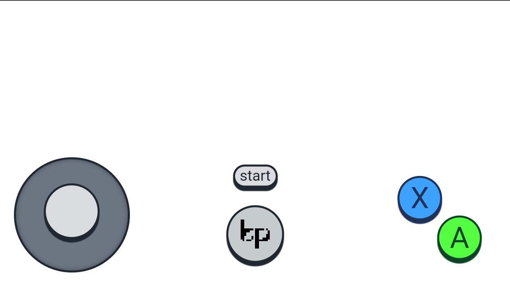
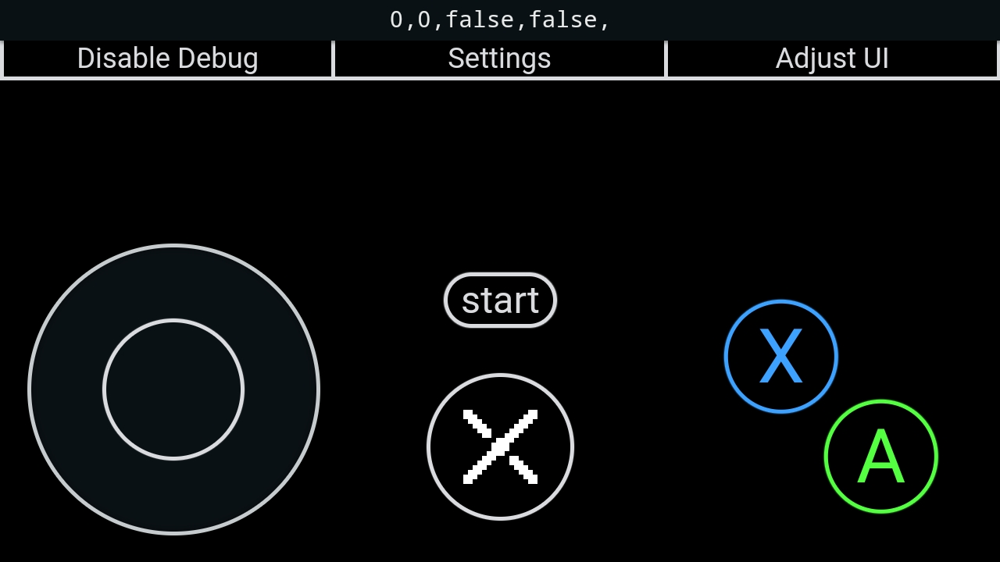

# Tetherplay
Turn a web browser into a game controller

## Screenshots

# Building
The project currently only runs on Linux
## Requirements
- udev
- libevdev
- pkg-config
- npm
- make

To launch, simply run `make` in the project root and follow the onscreen insttuctions (there is currently no `install` option)
